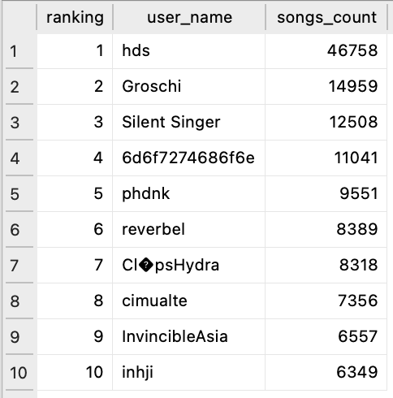
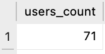
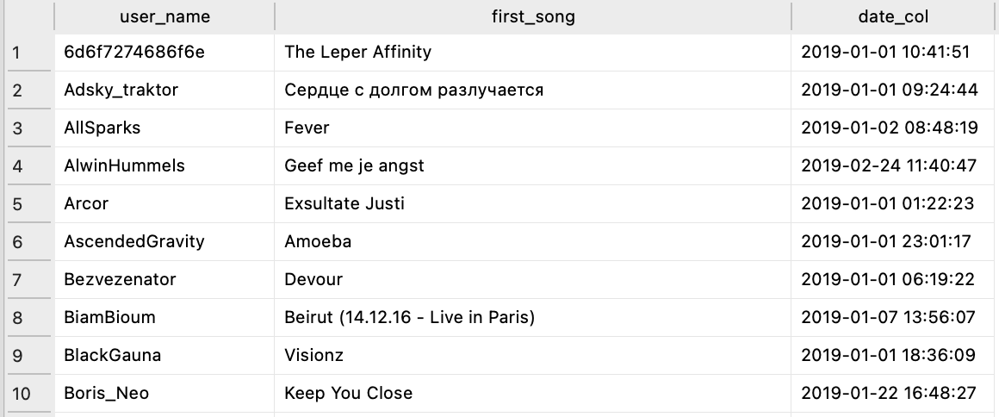
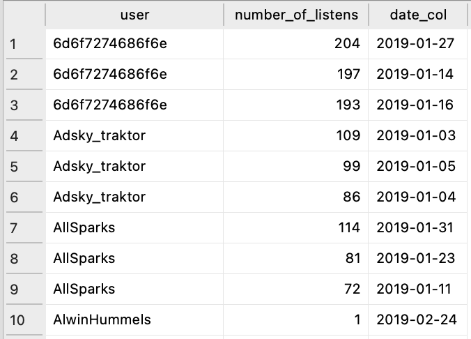

# Data Engineer Test Assignment

### The task

**Dataset**: A subset of [ListenBrainz's](https://listenbrainz.org/) dataset provided by the company.

**Setup**: Code must be easily be executed on any operating system. Include instructions on how to execute the code on MacOS.
### Step 1 - Data ingestion
Download the dataset. Set up a clean python project that loads this file into a database for easier analysis. Set up the database. Create one or more tables, think about how you structure and optimize the database to simplify later analysis. Write an ETL function that reads the export‑file and writes the data into your database. The function should be idempotent, so try to write it in a way that it can deal with already ingested, duplicate or corrupted data. For simplicity, use a sqlite database for this assignment.


### Step 2 - Data analysis
In the following, we ask you to run some SQL queries on the database you built in Task #1. The goal is to get more information out of the provided data.

a) Answer the following questions꞉
1. Who are the top 10 users with respect to number of songs listened to?
2. How many users did listen to some song on the 1st of March 2019?
3. For every user, what was the first song the user listened to?

b) For each user, we want to know the top 3 days on which they had the most listens, and how many listens they had on each of these days. The result should include the following꞉ 3 rows per user, 3 columns꞉ (user, number_of_listens, date). Sort the result by the user and the number_of_listens columns.

c) Write a query that calculates, on a daily basis, the absolute number of active users, and the percentage of active users among all users. We define a user to be
active one some day X, if the user listened to at least one song in the time interval [X-6 days, X] . The result should adhere to the following schema꞉ 1 row per day, 3 columns꞉ (date, number_active_users, percentage_active_users). Sort the result by date.

----------------
## The proposed solution

### Task #1 Data Ingestion

#### 1. Assumptions
- Corrupted data is considered as any row in the dataset that does not contain the information required to represent uniqueness and/or to identify and describe the events being analised. To be loaded into the SQLite database, a row must contain the artist id, track id, release id, user id, artist name, track name, release name, user name and listened_at timestamp.

#### 2. Solution
**2.1 How to run**

The project can be executed either locally or in a Docker container.

Once executed, the script will create a file named `song_plays.db` in the `data` directory. This file is a SQLite database with the loaded data.
Data can be queried by opening this file with a tool like [DB Browser for SQLite](https://sqlitebrowser.org/). 

##### Running locally
To run locally, you will need Python 3.11 or newer installed in your local environment. Then, just install the dependencies and execute the `main.py` file:

```
$ pip install -r requirements.txt
$ python ./main.py
```

##### Running with Docker
To run using Docker, run `docker-compose up` from the project root directory. 

This will build a Docker image according to instructions in `Dockerfile` and create a Docker container that will run in any environment. It will then execute once and exit.

The `docker-compose.yml` file has a volume configured in the `data/` directory. Once the container finishes its execution, you will find a file named `song_plays.db` in the `data/` directory. This file is a SQLite database with the loaded data. 

**2.2 ETL Implementation**

For the ETL implementation, I chose to model data as a wide-table. The main reason for that is to avoid an over-engineered solution: any data that is not useful should not be ingested. Considering that the questions posed in the Data Analysis task represent the business requirements, any data that is not used to answer a question will not be modelled for ingestion. It can then be expected that the resulting analytical database has a narrow scope, that aims to solve one set of problems. 

Choosing a wide-table approach comes with some caveats: as it scales, querying a table with too many columns can decrease one's ability to find the desired information when compared to finding it in categorised dimensions. Also, it makes it harder to deal with changes in the data source, requiring a full load of the data in each iteration. Therefore, as the demand for new attributes increases, it might be necessary to reassess and build a different model (e.g. a star-schema model). 

I decided to add two new columns to the table: `song_play_id` and `year_month`:

- `song_play_id` is a `TEXT` Primary Key with a constraint to uniquely identify each record being ingested in the table, and deal with corrupted, duplicated and already ingested data. The value for this column is generated by hashing the value of columns `track_id`, `artist_id`, `release_id`, `listened_at` and `user_id`. If the data required to build the PK is not available, the record is considered to be corrupted and its ingestion will be discarded. Duplicated data is filtered with support of the `dedup_tag` available in the dataset, as well as the `INSERT OR IGNORE INTO` command. 

- `year_month` is an `INTEGER` column used to partition data by year & month (e.g. `201901`, `201902`, etc). An index was also created based on this column. Since date columns are commonly used to filter datasets with historical data, `year_month` should improve query performance.

#### 3. Future improvements

- Build unit tests
- Ingest data directly from the ListenBrainz API
- Deploy it to a cloud provider (ideally AWS, using a S3 - Athena - DBT architecture to match the company's current stack) with IaC (Terraform) 
- Do a deep dive with stakeholders to understand data usage and improve modelling/performance/architecture if/when necessary
- Use Spark for parallel processing/partitioning to improve performance if/when necessary


### Task #2 Data analysis


a) **1. Who are the top 10 users with respect to number of songs listened to?**


`Answer`: 




`Query`:
```
WITH songs_count AS(
	SELECT 
	user_name,
	count(track_name) as songs_count
	FROM song_plays 
	GROUP BY user_name
	),

ranking AS(
	SELECT 
	dense_rank() over(order by songs_count desc) as ranking,
	user_name,
	songs_count
	FROM songs_count
	)
	
SELECT
	ranking, 
	user_name,
    songs_count
FROM ranking
WHERE ranking <= 10
```


**2. How many users did listen to some song on the 1st of March 2019?**


`Answer`:




`Query`:
```
SELECT 
count(distinct(user_name)) as users_count
FROM song_plays
WHERE date(listened_at,'unixepoch') =  date('2019-03-01')
```


**3. For every user, what was the first song the user listened to?**


`Preview`:




`Query`:
```
SELECT 
user_name,
first_value(track_name) over(
	partition by user_name
	order by listened_at asc
	) AS first_song, 
datetime(min(listened_at),'unixepoch') as date_col
FROM song_plays
GROUP BY user_name

```


**b) For each user, we want to know the top 3 days on which they had the most listens, and how many listens they had on each of these days. The result should include the following꞉ 3 rows per user, 3 columns꞉ (user, number_of_listens, date). Sort the result by the user and the number_of_listens columns.**


`Disclaimer`: not every user have listened to 3 songs or more, therefore some users have less then 3 rows.

`Preview`:




`Query`:
```
WITH listens AS(
	SELECT
		user_name,
		count(song_play_id) as number_of_listens, 
		date(listened_at,'unixepoch') as date_col
	FROM song_plays
	GROUP BY user_name, date_col
),

ranking AS(
	SELECT
		row_number() over(partition by user_name order by number_of_listens desc) as ranking,
		user_name,
		number_of_listens,
		date_col
	FROM listens
)
	
SELECT 
	user_name as user,
	number_of_listens,
	date_col
FROM ranking
WHERE ranking <= 3
ORDER BY user, number_of_listens desc
```


**c) Write a query that calculates, on a daily basis, the absolute number of active users, and the percentage of active users among all users. We define a user to be active one some day X, if the user listened to at least one song in the time interval [X-6 days, X] . The result should adhere to the following schema꞉ 1 row per day, 3 columns꞉ (date, number_active_users, percentage_active_users). Sort the result by date.**

>> My answer to this question was wrong, so I deleted it to avoid misleading yall. Also I thought it would be honest to let you know that we can be approved in technical challenges even when we make mistakes ;)

